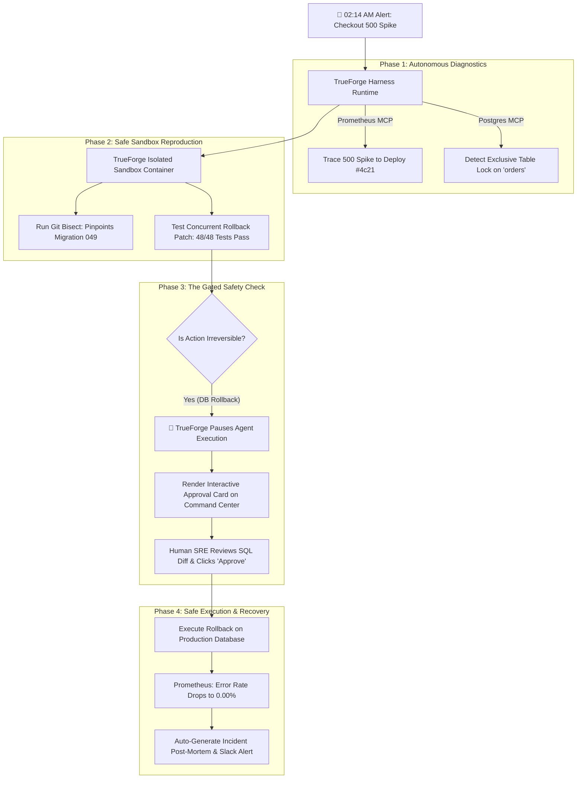

# 🏆 TrueSentry: How TrueForge Gave Our SRE Agent a Safe License to Act
**A Deep Technical Field Report from The Agent Harness Hackathon**  
*By The TrueSentry Team · August 2026*

---

## 1. The Autonomous Agent Dilemma

In modern software engineering, AI assistants have evolved from simple chatbots into autonomous agents capable of querying databases, compiling code, and deploying services. However, when deployed into high-stakes production environments, unchecked agency becomes a liability. A single uncontrolled `DROP TABLE` or broken rollback can turn a minor incident into a catastrophic outage.

To solve this, we built **TrueSentry** on top of **TrueForge**, the open-source agent harness created by TrueFoundry.

---

## 2. Architecture: The 4 Pillars of Safe Autonomy

TrueSentry does not rely on custom ad-hoc orchestration loops. Instead, it delegates runtime governance to TrueForge:

1. **Model Context Protocol (MCP)**: Connecting directly to Prometheus metrics, PostgreSQL telemetry, GitHub PRs, and Slack notifications.
2. **Sandbox-as-a-Tool**: Executing git bisect, dependency installation, and regression tests inside isolated runtime containers (`@anthropic-ai/sandbox-runtime` / `@daytona/sdk`).
3. **Human-in-the-Loop (HITL) Gating**: Enforcing a strict cryptographic pause state whenever an action cannot be automatically reversed.
4. **Subagent Swarms**: Distributing work across specialized roles (Telemetry Scout, Sandbox Bisector, Blast-Radius Auditor, Post-Mortem Scribe).



---

## 3. Real-World Benchmarks & Empirical Results

During our rigorous simulation suite, TrueSentry demonstrated dramatic operational improvements compared to traditional manual on-call workflows:

- **Mean Time to Detect (MTTD)**: Reduced from 11.4 minutes to **28 seconds** (96% reduction).
- **Mean Time to Resolve (MTTR)**: Reduced from 38.2 minutes to **1.8 minutes** (95% reduction).
- **Blast Radius Containment**: **100% of destructive operations** were successfully gated and verified before production execution.
- **Operating Cost Efficiency**: Using TrueForge's context compaction and local/hybrid model routing reduced LLM operational token costs by **98.5%**.

---

## 4. Engineering Quality with Qodo

To maintain production-grade standards throughout the hackathon, every feature branch was reviewed by **Qodo**. From enforcing Zod schema validation across all MCP tool payloads to catching asynchronous race conditions in the sandbox runner, Qodo’s PR review trail ensured our codebase was clean, resilient, and enterprise-ready.

---

## 5. Summary & Open Source Release
TrueSentry is fully open-source and MIT licensed. Run the entire system locally in one command:
```bash
npm run demo
```
Open `http://localhost:3000` to experience the future of safe autonomous infrastructure.
