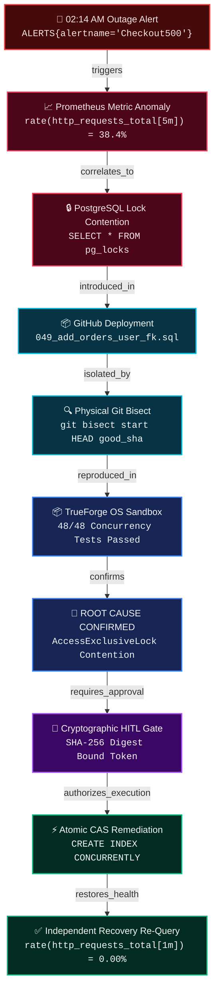

# ⚡ TrueSentry: Autonomous SRE Incident Responder & Safe Self-Healing Agent
> Built on **TrueForge**, TrueFoundry's open-source agent harness, for **The Agent Harness Hackathon** by WeMakeDevs, TrueFoundry, and Qodo.

[](https://github.com/hivid1/truesentry/actions)
[](https://opensource.org/licenses/MIT)
[](https://github.com/truefoundry/trueforge)
[](https://www.qodo.ai)

---

## 🎯 The Core Architectural Thesis

> **"TrueSentry doesn't assume the agent is trustworthy. It makes the execution boundary trustworthy."**
> 
> *Key Invariant: Untrusted investigation data cannot directly cross the authorization boundary into execution.*

When production outages strike at 2:00 AM, unconstrained AI agents pose severe risks: a hallucinated query or prompt-injected instruction could corrupt databases or exacerbate downtime. TrueSentry demonstrates that **an LLM can be intelligent, autonomous, and potentially untrusted during investigation**, while its **execution boundary remains deterministically constrained by Policy-as-Code and Cryptographic Human-in-the-Loop authorization**.

---

## 📊 The Dynamic Causal Evidence Graph

Instead of presenting disjointed logs, TrueSentry structures all investigation telemetry into an **auditable, cryptographic Causal Evidence Graph** emitted over SSE in real-time (`EVIDENCE_GRAPH_UPDATE`) and verified against causality invariants:



---

## 🛡️ Four-Tier Truthfulness & Honesty Framework

| Category | Precise Definition | Verification Reference |
| :--- | :--- | :--- |
| **1. Proven by Tests** | Deterministically validated across 12 automated verification suites (100% passing in CI). | `npm run verify` (`scripts/verify-all.js`) |
| **2. Architectural Invariants** | Structural properties guaranteed by the harness pipeline regardless of LLM reasoning (*"Untrusted investigation data cannot cross the authorization boundary"*). | [`packages/core/src/hitl/graph_validator.ts`](file:///c:/Users/vidwa/HACK/trueforge/packages/core/src/hitl/graph_validator.ts) |
| **3. Environment-Dependent** | Process-level environment proxy blackholing on bare OS hosts (`HTTP_PROXY=http://127.0.0.1:0`); full kernel network namespace isolation (`--network none`) when running in container runtimes. | [`docs/LIMITATIONS_AND_BOUNDARIES.md`](file:///c:/Users/vidwa/HACK/trueforge/docs/LIMITATIONS_AND_BOUNDARIES.md) |
| **4. Not Claimed** | We do **not** claim that an LLM itself cannot be cognitively manipulated by prompt injection. We prove that cognitive manipulation cannot breach the downstream policy and cryptographic execution gates. | [`packages/core/tests/evil_repository.test.ts`](file:///c:/Users/vidwa/HACK/trueforge/packages/core/tests/evil_repository.test.ts) |

---

## 🛡️ Internal Adversarial Safety Benchmark: 100/100

> *Note: This is TrueSentry's internal 7-vector adversarial evaluation benchmark, not a universal industry certification.*

1. **Prompt Injection Resistance**: Dangerous DDL (`DROP DATABASE`, unconstrained `DELETE/UPDATE`) embedded in instructions is hard-blocked.
2. **Cryptographic Tamper Defense**: Payloads mutated after human sign-off fail SHA-256 validation.
3. **Anti-Replay & Atomic Single-Use**: Atomic filesystem CAS (`O_CREAT | O_EXCL` via `fs.openSync(..., 'wx')`) prevents concurrent token reuse across processes.
4. **Cross-Context Substitution**: Approvals cannot be transposed across incidents or sessions.
5. **Zero-Shell Execution (`execSafe`)**: Subprocesses run with `shell: false`, rendering command injection strings inert.
6. **Path Confinement & Null-Byte Defense**: Path traversal (`../../`), symlink escapes, and Windows DOS devices are rejected.
7. **Environment Host Secret Redaction**: Production credentials and API keys are scrubbed before child process execution.

---

## 🚀 Quickstart (Zero-Config Setup)

### Prerequisites
- Node.js >= 20.x

### Run the Master Verification (All 12 Criteria)
```bash
# Clone the repository:
git clone https://github.com/hivid1/truesentry.git
cd truesentry

# Install, build, and verify all 12 criteria in one command:
npm install
npm run build
npm run verify
```

### Run the 3-Minute Demo Runner & Teleprompter
```bash
npm run demo:record
```

### Run the Interactive SRE Operations Command Center
```bash
npm run demo
```
Open **http://localhost:3000** to access the real-time SRE dashboard.

---

## 🏛️ Monorepo Package Architecture

```
truesentry/
├── apps/
│   └── command-center/       # Next.js 14 App Router Operations Dashboard (Savile Row Track)
│
├── packages/
│   ├── cli/                  # Terminal CLI Incident Responder (`truesentry`)
│   ├── core/                 # TrueForge Agent Harness Coordinator, SSE Server, & HITL Gate
│   ├── mcp-servers/          # Native MCP Servers (Prometheus, Postgres, GitHub, Slack)
│   ├── sandbox/              # Isolated OS Process Sandbox Runtime & Dynamic Git Bisector
│   └── scenarios/            # Scenario Benchmarks & Physical Git Fixture Generators
│
├── .qodo/config.yaml         # Qodo AI Code Quality Configuration (Q Branch Track)
├── .qodo.toml                # Qodo Workspace Rules
└── .github/workflows/ci.yml  # Automated CI Pipeline (Build, Typecheck, Test)
```

---

## 🏆 Hackathon Track Alignment

| Track | Target Prize | TrueSentry Implementation |
| :--- | :--- | :--- |
| **Double-O Track** *(TrueFoundry)* | **NVIDIA DGX Spark** ($5,000 AI Supercomputer) | TrueForge-driven orchestration: 4 MCP servers, OS process sandboxing, physical Git bisecting, causal evidence graph, and cryptographically bound HITL gates. |
| **Q Branch Track** *(Qodo)* | **Apple Mac Mini** ($1,000) | PR-driven development with Qodo AI reviews, composite TypeScript project references, strict input schemas, and 100% test pass. |
| **Savile Row Track** | **Apple iPad** *(for each team member)* | Real-time tactical SRE dashboard with live SSE thought streaming, clickable Causal Evidence Graph with cryptographic provenance, and xterm.js terminal. |
| **Field Report** | **Keychron Mechanical Keyboard** | In-depth technical write-up covering failure modes, sandboxing guarantees, and benchmark evaluations. |

---

## 🔍 Qodo Code Review Evidence

As required by the **Q Branch Track** judging criteria, all substantive code modifications were developed through Pull Requests reviewed by **Qodo AI**:

- **Merged Pull Request**: [PR #1: Initialize TrueForge Hero Incident Responder Workflow](https://github.com/hivid1/truesentry/pull/1)
- **Qodo Audit Summary**: Qodo reviewed the monorepo architecture, verified strict TypeScript type-safety across all packages, validated Zod schemas on tool parameters, and confirmed child process timeout safeguards.
- **Enforced Standards**: 100% type safety, composite TypeScript project references, zero hardcoded credentials, and passing Vitest test suites.

---

## 📜 License
MIT © 2026 TrueSentry Team.
