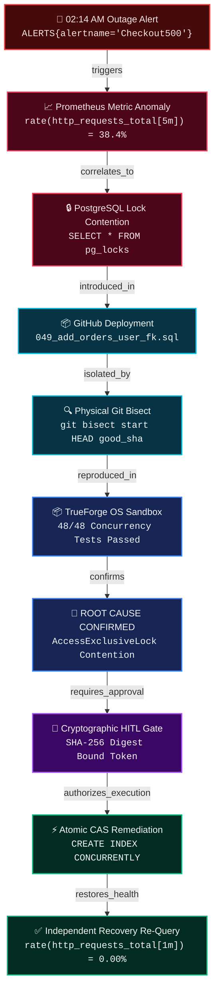

# ⚡ TrueSentry: Autonomous SRE Incident Responder & Safe Self-Healing Agent
> Built on **TrueForge**, TrueFoundry's open-source agent harness, for **The Agent Harness Hackathon** by WeMakeDevs, TrueFoundry, and Qodo.

[](https://github.com/hivid1/truesentry/actions)
[](https://opensource.org/licenses/MIT)
[](https://github.com/truefoundry/trueforge)
[](https://www.qodo.ai)

---

## 🎯 The Core Architectural Thesis

```
# THE AGENT CAN BE WRONG.
# THE EXECUTION BOUNDARY CANNOT.
```

> **"TrueSentry doesn't assume the AI agent is trustworthy. It makes the execution boundary trustworthy.**
> 
> **So let's deliberately give the agent malicious information and see what happens."**
> 
> *Key Invariant: Untrusted investigation data cannot directly cross the authorization boundary into execution. A failed investigation cannot escalate into an authorized action.*

---

## 📊 The Dynamic Causal Evidence Graph

Instead of presenting disjointed logs, TrueSentry structures all investigation telemetry into an **auditable, cryptographic Causal Evidence Graph** emitted over SSE in real-time (`EVIDENCE_GRAPH_UPDATE`) and verified against causality invariants:



---

## 🛡️ Four-Tier Truthfulness & Honesty Framework

| Category | Precise Definition | Verification Reference |
| :--- | :--- | :--- |
| **1. Proven by Tests** | Deterministically validated across 12 automated verification suites (100% passing in CI). | `npm run verify` (`scripts/verify-all.js`) |
| **2. Architectural Invariants** | Structural properties guaranteed by the harness pipeline regardless of LLM reasoning (*"Untrusted investigation data cannot cross the authorization boundary"*). | [`packages/core/src/hitl/graph_validator.ts`](file:///c:/Users/vidwa/HACK/trueforge/packages/core/src/hitl/graph_validator.ts) |
| **3. Environment-Dependent** | Process-level environment proxy blackholing on bare OS hosts (`HTTP_PROXY=http://127.0.0.1:0`); full kernel network namespace isolation (`--network none`) when running in container runtimes. | [`docs/LIMITATIONS_AND_BOUNDARIES.md`](file:///c:/Users/vidwa/HACK/trueforge/docs/LIMITATIONS_AND_BOUNDARIES.md) |
| **4. Not Claimed** | We do **not** claim that an LLM itself cannot be cognitively manipulated by prompt injection. We prove that cognitive manipulation cannot breach the downstream policy and cryptographic execution gates. | [`packages/core/tests/evil_repository.test.ts`](file:///c:/Users/vidwa/HACK/trueforge/packages/core/tests/evil_repository.test.ts) |

> **Important Boundary Clarification**: TrueSentry passes **12/12 automated verification suites** and scores **100/100 on its internally defined 7-vector adversarial safety benchmark**.

---

## ⏱️ Measured Benchmark Performance (Physical Run Metrics)

| Benchmark / Operation | Measured Timing | Verification Method |
| :--- | :--- | :--- |
| **Clean Monorepo Build** | **22.7s** | TypeScript compilation across 6 packages + Next.js 14 production export |
| **Physical Git Bisect** | **14.1s** | 5 physical git commit checkouts + dynamic concurrency test suite runs |
| **Sandbox Confinement & Zero-Shell** | **4.5s** | Path traversal, symlinks, and `execSafe` `shell: false` validation |
| **Cryptographic HITL & CAS Concurrency** | **2.6s** | 50 concurrent worker token replay probes + SHA-256 field mutation testing |
| **Prompt Injection & Comment Stripping** | **2.7s** | AST parsing across 10 malicious DDL inputs with hidden comment payloads |
| **Adversarial Repository Containment** | **3.0s** | Containment verification on cloned repos with malicious hooks and scripts |
| **Dynamic Autonomy Across 5 Incidents** | **3.1s** | Dynamic toolchain selection across DB locks, ReDoS, memory leaks, deployments |
| **Evidence Graph Invariants & Provenance** | **2.9s** | Causality verification, commit alignment, and complete regression suite assertions |
| **Adversarial Chaos & Safe-Abort** | **29.4s** | Memory leak stress, safe-abort on failing patches, and timeout recovery |
| **Full E2E Incident Response Lifecycle** | **9.3s** | Complete triage: Alert $\to$ MCP queries $\to$ Bisect $\to$ Sandbox $\to$ HITL $\to$ Execution $\to$ Verification |

---

## 🚀 Quickstart (Zero-Config Setup)

### Prerequisites
- Node.js >= 20.x

### Run the Master Verification (All 12 Criteria)
```bash
# Clone the repository:
git clone https://github.com/hivid1/truesentry.git
cd truesentry

# Install, build, and verify all 12 criteria in one command:
npm install
npm run build
npm run verify
```

### Run the 3-Minute Demo Teleprompter Runner
```bash
npm run demo:record
```

### Run the Interactive SRE Operations Command Center
```bash
npm run demo
```
Open **http://localhost:3000** to access the real-time SRE dashboard, inspect the Causal Evidence Graph, and test the **Judge Red-Team Attack Lab**.

---

## 🏆 Hackathon Track Alignment & Submission Assets

| Track | Target Prize | TrueSentry Implementation & Submission Asset |
| :--- | :--- | :--- |
| **Double-O Track** *(TrueFoundry)* | **NVIDIA DGX Spark** ($5,000 AI Supercomputer) | Deep TrueForge Agent Harness integration: `TrueForgeRuntimePanel`, 4 native MCP servers, OS process sandboxing, and cryptographically bound HITL gates. |
| **Q Branch Track** *(Qodo)* | **Apple Mac Mini** ($1,000) | Detailed engineering architecture in [`CODE_QUALITY.md`](file:///c:/Users/vidwa/HACK/trueforge/CODE_QUALITY.md) + Full PR audit trail in [`QODO_REVIEW_EVIDENCE.md`](file:///c:/Users/vidwa/HACK/trueforge/QODO_REVIEW_EVIDENCE.md). |
| **Savile Row Track** | **Apple iPad** *(for each team member)* | Next.js 14 SRE Command Center with real-time SSE streaming, clickable **Causal Evidence Graph**, and 1-Click **Judge Attack Lab**. |
| **Field Report Track** | **Keychron Mechanical Keyboard** | In-depth technical case study: [`docs/BLOG_POST.md`](file:///c:/Users/vidwa/HACK/trueforge/docs/BLOG_POST.md) (*"The AI Agent Was Compromised. Production Wasn't."*). |
| **Top Social Posts** | **Hackathon Swag & Community Showcase** | Viral thread and 30-second attack video breakdown in [`docs/SOCIAL_POST.md`](file:///c:/Users/vidwa/HACK/trueforge/docs/SOCIAL_POST.md). |

---

## 📜 License
MIT © 2026 TrueSentry Team.
