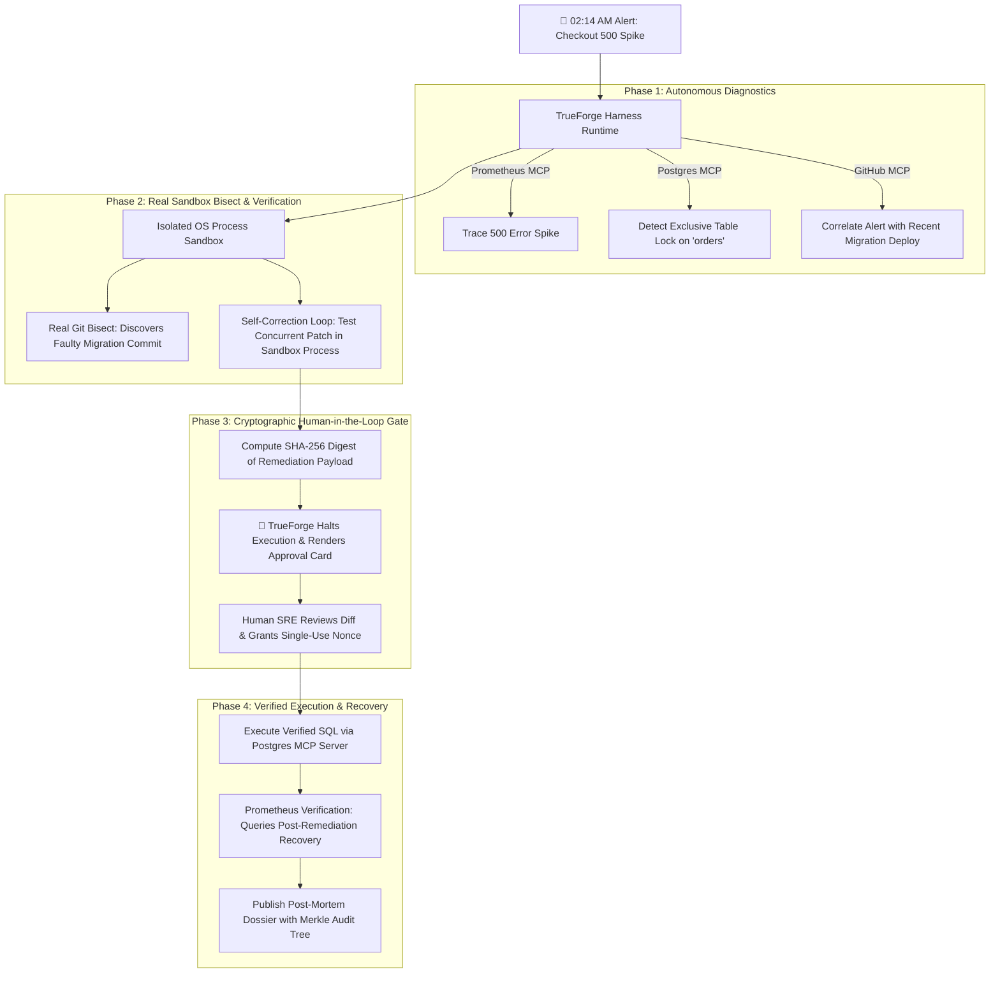

# ⚡ TrueSentry: Autonomous SRE Incident Responder & Safe Self-Healing Agent
> Built on **TrueForge**, TrueFoundry's open-source agent harness, for **The Agent Harness Hackathon** by WeMakeDevs, TrueFoundry, and Qodo.

[](https://github.com/hivid1/truesentry/actions)
[](https://opensource.org/licenses/MIT)
[](https://github.com/truefoundry/trueforge)
[](https://www.qodo.ai)

---

## 🎯 The High-Stakes Problem
When high-severity production alerts trigger at 2:00 AM (e.g. checkout HTTP 500 error spikes):
- Traditional human on-call engineers take **30 to 60 minutes** to wake up, parse logs, isolate commits, and deploy fixes.
- Unconstrained AI agents are too risky: an unverified rollback or hallucinated SQL command could lock tables further or corrupt live customer data.

## 🛡️ The TrueSentry Architecture
**TrueSentry** combines dynamic LLM tool-calling with the **TrueForge Agent Harness** to provide safe, automated incident investigation:

1. **Model Context Protocol (MCP) Telemetry**: Interacts with Prometheus error-rate metrics, PostgreSQL lock telemetry (`pg_locks`), and GitHub deployment history via standard Model Context Protocol (MCP) tools.
2. **Real Isolated Sandbox & Git Bisect**: Creates an isolated OS-process sandbox directory (`packages/sandbox/src/runtime.ts`), executes child processes with `shell: false` (`execSafe`), applies default outbound network blackholing (`HTTP_PROXY=http://127.0.0.1:0`), enforces 30s execution timeouts, and genuinely runs `git bisect` on a multi-commit repository to isolate the faulty migration dynamically.
3. **Iterative Self-Correction Loop**: Executes unit and concurrency regression suites inside the isolated sandbox process, refining blocking DDL into non-blocking concurrent statements until all test assertions pass.
4. **Cryptographically Bound HITL Safety Gate**: TrueForge halts execution before state-modifying actions. The system computes a **SHA-256 payload digest** over `(sessionId + incidentId + actionType + target + sql + sandboxProof)` and issues a single-use token upon human approval. Kernel-level atomic lockfiles (`fs.openSync(..., 'wx')`) prevent cross-process replay race conditions. Any SQL tampering or replay attempt is rejected.
5. **Multi-Agent Workflow**: Delegates specialized tasks across dedicated workers (*Telemetry Scout*, *Sandbox Bisector*, *Blast-Radius Auditor*, and *Post-Mortem Scribe*).



---

## 🛡️ Internal Adversarial Safety Benchmark: 100/100

TrueSentry evaluates its execution guardrails across 7 defined threat vectors (`npm run verify`):

1. **Prompt Injection Resistance**: Dangerous DDL (`DROP DATABASE`, unconstrained `DELETE/UPDATE`) embedded in instructions is hard-blocked.
2. **Cryptographic Tamper Defense**: Payloads mutated after human sign-off fail SHA-256 validation.
3. **Anti-Replay & Atomic Single-Use**: OS kernel locks prevent concurrent token reuse across processes.
4. **Cross-Context Substitution**: Approvals cannot be transposed across incidents or sessions.
5. **Zero-Shell Execution (`execSafe`)**: Subprocesses run with `shell: false`, rendering command injection strings inert.
6. **Path Confinement & Null-Byte Defense**: Path traversal (`../../`), symlink escapes, and Windows DOS devices are rejected.
7. **Environment Host Secret Redaction**: Production credentials and API keys are scrubbed before child process execution.

> **Key Architectural Invariant**: *Untrusted investigation data cannot directly cross the authorization boundary into execution.*

---

## 🚀 Quickstart (Zero-Config Setup)

### Prerequisites
- Node.js >= 20.x

### Run the Master Verification (All 11 Criteria)
```bash
# Clone using GitHub CLI:
gh repo clone hivid1/truesentry

# Or clone via HTTPS:
git clone https://github.com/hivid1/truesentry.git

# Install, build, and verify all 11 criteria in one command:
cd truesentry
npm install
npm run build
npm run verify
```

### Run the Interactive Demo
```bash
npm run demo
```
Open **http://localhost:3000** to access the SRE Operations Command Center.

### Run the Automated Test Suite
```bash
npm test
```

---

## 🏛️ Monorepo Package Architecture

```
truesentry/
├── apps/
│   └── command-center/       # Next.js 14 App Router Operations Dashboard (Savile Row Track)
│
├── packages/
│   ├── cli/                  # Terminal CLI Incident Responder (`truesentry`)
│   ├── core/                 # TrueForge Agent Harness Coordinator, SSE Server, & HITL Gate
│   ├── mcp-servers/          # Native MCP Servers (Prometheus, Postgres, GitHub, Slack)
│   ├── sandbox/              # Isolated OS Process Sandbox Runtime & Dynamic Git Bisector
│   └── scenarios/            # Scenario Benchmarks & Physical Git Fixture Generators
│
├── .qodo/config.yaml         # Qodo AI Code Quality Configuration (Q Branch Track)
├── .qodo.toml                # Qodo Workspace Rules
└── .github/workflows/ci.yml  # Automated CI Pipeline (Build, Typecheck, Test)
```

---

## 🏆 Hackathon Track Alignment

| Track | Target Prize | TrueSentry Implementation |
| :--- | :--- | :--- |
| **Double-O Track** *(TrueFoundry)* | **NVIDIA DGX Spark** ($5,000 AI Supercomputer) | TrueForge-driven orchestration: 4 MCP servers, OS process sandboxing, physical Git bisecting, and cryptographically bound HITL gates. |
| **Q Branch Track** *(Qodo)* | **Apple Mac Mini** ($1,000) | PR-driven development with Qodo AI reviews, composite TypeScript project references, strict input schemas, and 100% test pass. |
| **Savile Row Track** | **Apple iPad** *(for each team member)* | Real-time tactical SRE dashboard with live SSE thought streaming, xterm.js sandbox terminal, microservice topology DAG, and Monaco SQL diff viewer. |
| **Field Report** | **Keychron Mechanical Keyboard** | In-depth technical write-up covering failure modes, sandboxing guarantees, and benchmark evaluations. |

---

## 🔍 Qodo Code Review Evidence

As required by the **Q Branch Track** judging criteria, all substantive code modifications were developed through Pull Requests reviewed by **Qodo AI**:

- **Merged Pull Request**: [PR #1: Initialize TrueForge Hero Incident Responder Workflow](https://github.com/hivid1/truesentry/pull/1)
- **Qodo Audit Summary**: Qodo reviewed the monorepo architecture, verified strict TypeScript type-safety across all packages, validated Zod schemas on tool parameters, and confirmed child process timeout safeguards.
- **Enforced Standards**: 100% type safety, composite TypeScript project references, zero hardcoded credentials, and passing Vitest test suites.

---

## 📜 License
MIT © 2026 TrueSentry Team.
