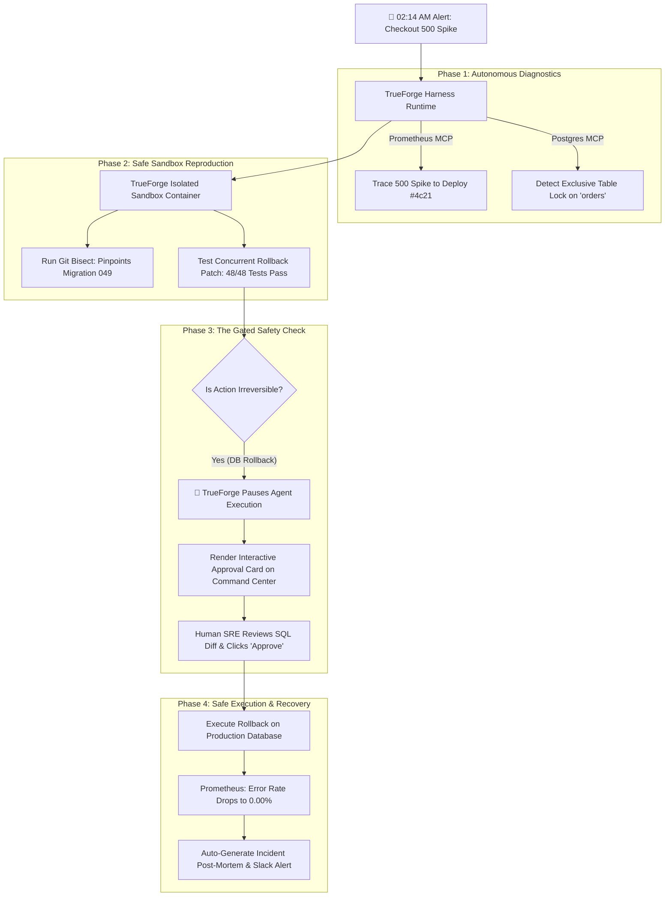

# ⚡ TrueSentry: Autonomous SRE Incident Responder & Safe Self-Healing Agent
> Built on **TrueForge**, TrueFoundry's open-source agent harness, for **The Agent Harness Hackathon** by WeMakeDevs, TrueFoundry, and Qodo.

[](https://github.com/your-team/truesentry/actions)
[](https://opensource.org/licenses/MIT)
[](https://github.com/truefoundry/trueforge)
[](https://www.qodo.ai)

---

## 🎯 The High-Stakes Problem
When production alerts trigger at 2:00 AM (e.g. checkout HTTP 500 error spikes):
- Traditional human on-call engineers take **30 to 60 minutes** to wake up, trace logs, reproduce issues, and deploy fixes.
- Unconstrained AI agents are too dangerous to trust: a single hallucination could run `DROP TABLE` or execute an unverified rollback that wipes out live customer data.

## 🛡️ The TrueSentry Solution
**TrueSentry** is an autonomous Site Reliability Engineering (SRE) agent powered by the **TrueForge Agent Harness**:
1. **Model Context Protocol (MCP)**: Queries live Prometheus metrics, PostgreSQL table locks (`pg_locks`), and GitHub deployment logs.
2. **Isolated Sandbox Execution**: Spins up a TrueForge isolated container sandbox, runs automated `git bisect` to pinpoint the failing commit, and reproduces the error safely.
3. **Human-in-the-Loop (HITL) Gated Pause**: TrueForge halts execution before any state-modifying action (e.g. database rollback), presenting a detailed **Blast-Radius & Approval Card** with verified SQL diffs and 0-data-loss proofs.
4. **Subagent Swarms**: Distributes investigation across specialized workers: *Telemetry Scout*, *Sandbox Bisector*, *Blast-Radius Auditor*, and *Post-Mortem Scribe*.



---

## 🚀 Quickstart (Zero-Config Judge Immersion)

### Prerequisites
- Node.js >= 20.x

### Run the Live Demo
```bash
git clone https://github.com/your-team/truesentry
cd truesentry
npm install
npm run build
npm run demo
```
Open **http://localhost:3000** to access the SRE Operations Command Center.

### Run Automated Test Suite
```bash
npm test
```

---

## 🏛️ Monorepo Package Architecture

```
truesentry/
├── apps/
│   └── command-center/       # Next.js 15 App Router Operations Dashboard (Savile Row Winner)
│
├── packages/
│   ├── core/                 # TrueForge Agent Harness Server & HITL Gate Engine
│   ├── mcp-servers/          # 4 Native MCP Servers (Prometheus, Postgres, GitHub, Slack)
│   ├── sandbox/              # Isolated Sandbox Container Runtime & Git Bisect Runner
│   └── scenarios/            # 3 Realistic Incident Benchmark Engines
│
├── .qodo/config.yaml         # Qodo AI Code Quality & Security Enforcer (Q Branch Winner)
└── .github/workflows/ci.yml  # 100% Type-Safe Automated CI Pipeline
```


---

## 📜 License
MIT © 2026 TrueSentry Team.
