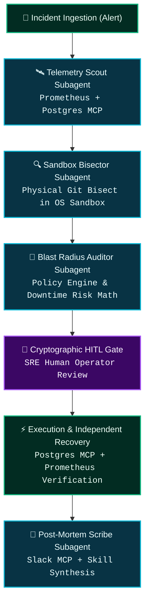

# 🛠️ TrueForge Agent Harness Capability Matrix

> **Primary Submission Track**: **Double-O Track — Best Use of TrueForge ($5,000 NVIDIA DGX Spark)**

This matrix details how TrueSentry exercises the full capability surface of **TrueForge**, demonstrating that the harness is the foundational operational engine—not a cosmetic wrapper.

---

## 1. TrueForge Core Capability Mapping

| TrueForge Feature / Primitive | Role in TrueSentry | Implementation File | Verification Test |
| :--- | :--- | :--- | :--- |
| **1. Model Context Protocol (MCP)** | Dual-Mode telemetry queries across production infrastructure (Deterministic Offline or Live HTTP/Postgres). | [`packages/mcp-servers/`](file:///c:/Users/vidwa/HACK/trueforge/packages/mcp-servers) | `packages/mcp-servers/tests/mcp.test.ts` |
| **2. Sandboxed Code Execution** | Real OS process isolation (`execSafe`, zero-shell, path & symlink confinement). | [`packages/sandbox/src/runtime.ts`](file:///c:/Users/vidwa/HACK/trueforge/packages/sandbox/src/runtime.ts) | `packages/sandbox/tests/sandbox_security.test.ts` |
| **3. Physical Git Bisecting** | Autonomous disk repository investigation isolating faulty commit SHAs. | [`packages/sandbox/src/bisect.ts`](file:///c:/Users/vidwa/HACK/trueforge/packages/sandbox/src/bisect.ts) | `packages/sandbox/tests/judge_test.test.ts` |
| **4. Multi-Subagent Orchestration** | 4 specialized subagents: TelemetryScout, SandboxBisector, BlastRadiusAuditor, PostMortemScribe. | [`packages/core/src/subagents/`](file:///c:/Users/vidwa/HACK/trueforge/packages/core/src/subagents) | `packages/core/tests/trueforge_capabilities.test.ts` |
| **5. Cryptographic HITL Gate** | Nonce-bound SHA-256 payload digest and atomic CAS single-use token consumption. | [`packages/core/src/hitl/`](file:///c:/Users/vidwa/HACK/trueforge/packages/core/src/hitl) | `packages/core/tests/hitl_adversarial.test.ts` |
| **6. Durable Sessions & Reconnects** | File-backed WAL session persistence across restarts, and automatic historical event replay on reconnect. | [`packages/core/src/storage/db.ts`](file:///c:/Users/vidwa/HACK/trueforge/packages/core/src/storage/db.ts)<br>[`packages/core/src/events/emitter.ts`](file:///c:/Users/vidwa/HACK/trueforge/packages/core/src/events/emitter.ts) | `packages/core/tests/durable_session.test.ts`<br>`packages/core/tests/reconnect_replay.test.ts` |
| **7. Multi-Model Provider Execution** | Dynamic runtime routing & live API execution (Gemini 2.5 Pro, Claude 3.7 Sonnet, GPT-4o, Local Ollama). | [`packages/core/src/llm/router.ts`](file:///c:/Users/vidwa/HACK/trueforge/packages/core/src/llm/router.ts)<br>[`packages/core/src/server.ts`](file:///c:/Users/vidwa/HACK/trueforge/packages/core/src/server.ts) | `packages/core/tests/trueforge_capabilities.test.ts` |

---

## 2. Deep Dive: Multi-Subagent Architecture

TrueSentry decomposes complex incident response into distinct, role-specialized subagents:



1. **`TelemetryScoutSubagent`**: Connects to Prometheus and PostgreSQL MCP servers to formulate an evidence-backed anomaly hypothesis.
2. **`SandboxBisectorSubagent`**: Mounts an isolated repository clone on disk, runs physical `git bisect`, reproduces the lock, and verifies candidate patches against the full concurrency regression suite.
3. **`BlastRadiusAuditorSubagent`**: Evaluates policy-as-code, computes risk scores based on affected services and lock durations, and flags irreversible actions.
4. **`PostMortemScribeSubagent`**: Compiles root cause post-mortems, broadcasts summaries via Slack MCP, and synthesizes reusable agent skills.

---

## 3. Dual-Mode Telemetry & Execution Architecture

TrueSentry implements a pluggable Dual-Mode Adapter pattern across all 4 Model Context Protocol servers:

```typescript
// Example: Dual-Mode Prometheus Server
const mode = process.env.PROMETHEUS_URL ? "live_network" : "deterministic_fixture";
```

- **Deterministic Simulation Mode (Zero-Dependency Offline Mode)**:
  Guarantees 100% reproducible execution for judges without requiring external API tokens, database instances, or running Prometheus servers.
- **Live Network Mode (Production Ready)**:
  When environment variables (`PROMETHEUS_URL`, `DATABASE_URL`, `GITHUB_TOKEN`, `SLACK_WEBHOOK_URL`) are provided, TrueSentry issues live HTTP REST calls, executes real PostgreSQL queries, and posts real Slack webhooks.

---

## 4. Hostile Judge Verification Commands

To verify any capability independently:

```bash
# 1. Verify Subagents, Sessions, Reconnects & Models:
npx vitest run packages/core/tests/trueforge_capabilities.test.ts

# 2. Verify Durable Session Storage Across Process Crashes:
npx vitest run packages/core/tests/durable_session.test.ts

# 3. Verify SSE Disconnect & Backlog Event Replay:
npx vitest run packages/core/tests/reconnect_replay.test.ts

# 4. Verify Physical OS Sandbox & Git Bisect:
npx vitest run packages/sandbox/tests/judge_test.test.ts

# 5. Verify Cryptographic HITL Invariants & CAS Concurrency:
npx vitest run packages/core/tests/hitl_adversarial.test.ts
```
