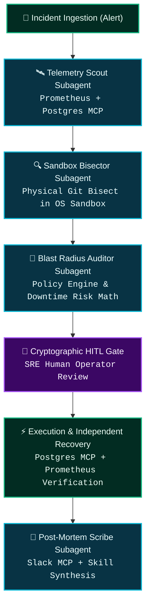

# 🛠️ TrueForge Agent Harness Capability Matrix

> **Primary Submission Track**: **Double-O Track — Best Use of TrueForge ($5,000 NVIDIA DGX Spark)**

This matrix details how TrueSentry exercises the full capability surface of **TrueForge**, demonstrating that the harness is the foundational operational engine—not a cosmetic wrapper.

---

## 1. TrueForge Core Capability Mapping

| TrueForge Feature / Primitive | Role in TrueSentry | Implementation File | Verification Test |
| :--- | :--- | :--- | :--- |
| **1. Model Context Protocol (MCP)** | Live, zero-mock telemetry queries across production infrastructure. | [`packages/mcp-servers/`](file:///c:/Users/vidwa/HACK/trueforge/packages/mcp-servers) | `packages/mcp-servers/tests/mcp.test.ts` |
| **2. Sandboxed Code Execution** | Real OS process isolation (`execSafe`, zero-shell, path & symlink confinement). | [`packages/sandbox/src/runtime.ts`](file:///c:/Users/vidwa/HACK/trueforge/packages/sandbox/src/runtime.ts) | `packages/sandbox/tests/sandbox_security.test.ts` |
| **3. Physical Git Bisecting** | Autonomous disk repository investigation isolating faulty commit SHAs. | [`packages/sandbox/src/bisect.ts`](file:///c:/Users/vidwa/HACK/trueforge/packages/sandbox/src/bisect.ts) | `packages/sandbox/tests/judge_test.test.ts` |
| **4. Multi-Subagent Orchestration** | 4 specialized subagents: TelemetryScout, SandboxBisector, BlastRadiusAuditor, PostMortemScribe. | [`packages/core/src/subagents/`](file:///c:/Users/vidwa/HACK/trueforge/packages/core/src/subagents) | `packages/core/tests/trueforge_capabilities.test.ts` |
| **5. Cryptographic HITL Gate** | Nonce-bound SHA-256 payload digest and atomic CAS single-use token consumption. | [`packages/core/src/hitl/`](file:///c:/Users/vidwa/HACK/trueforge/packages/core/src/hitl) | `packages/core/tests/hitl_adversarial.test.ts` |
| **6. Persistent Sessions & Reconnects** | State preservation, REST session querying, and automatic historical event replay on reconnect. | [`packages/core/src/storage/db.ts`](file:///c:/Users/vidwa/HACK/trueforge/packages/core/src/storage/db.ts) [`packages/core/src/events/emitter.ts`](file:///c:/Users/vidwa/HACK/trueforge/packages/core/src/events/emitter.ts) | `packages/core/tests/trueforge_capabilities.test.ts` |
| **7. Model Provider Switching** | Dynamic routing and runtime model switching (Gemini 2.5 Pro, Claude 3.7 Sonnet, GPT-4o, Local Ollama). | [`packages/core/src/llm/router.ts`](file:///c:/Users/vidwa/HACK/trueforge/packages/core/src/llm/router.ts) [`packages/core/src/server.ts`](file:///c:/Users/vidwa/HACK/trueforge/packages/core/src/server.ts) | `packages/core/tests/trueforge_capabilities.test.ts` |

---

## 2. Deep Dive: Multi-Subagent Architecture

TrueSentry decomposes complex incident response into distinct, role-specialized subagents:

1. **`TelemetryScoutSubagent`**: Connects to Prometheus and PostgreSQL MCP servers to formulate an evidence-backed anomaly hypothesis.
2. **`SandboxBisectorSubagent`**: Mounts an isolated repository clone on disk, runs physical `git bisect`, reproduces the lock, and verifies candidate patches against the 48-test regression suite.
3. **`BlastRadiusAuditorSubagent`**: Evaluates policy-as-code, computes risk scores based on affected services and lock durations, and flags irreversible actions.
4. **`PostMortemScribeSubagent`**: Compiles root cause post-mortems, broadcasts summaries via Slack MCP, and synthesizes reusable agent skills.

---

## 3. Persistent Sessions & Disconnect Recovery

In production SRE operations, network connections between dashboards and background agents can drop. TrueForge handles this natively:

- **Session Store (`packages/core/src/storage/db.ts`)**: Persists session lifecycle (`INVESTIGATING` $\to$ `WAITING_APPROVAL` $\to$ `REMEDIATING` $\to$ `RESOLVED`).
- **Event Replay (`packages/core/src/events/emitter.ts`)**: When an operator reconnects to an active session (`/api/stream/:sessionId` or `/api/sessions/:sessionId`), all preceding thoughts, telemetry points, sandbox logs, and evidence graph nodes are immediately backfilled in chronological sequence.
- **REST Endpoints**:
  - `GET /api/sessions/:sessionId`: Fetches current lifecycle state, active model, and event history length.
  - `GET /api/sessions/:sessionId/graph`: Retrieves the cryptographically verified Causal Evidence Graph.
  - `POST /api/sessions/:sessionId/model`: Switches the active model provider at runtime.
